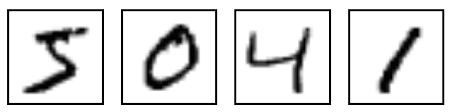
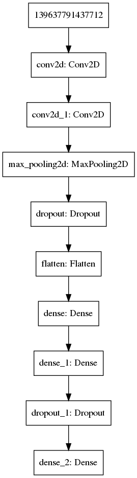

# MNIST project

Working with the [MNIST DATABASE](http://yann.lecun.com/exdb/mnist/) of handwritten digits.

Designing and training an algorithm with the libraries Keras with Tensorflow as backend for it to learn to distinguish between handwritten numbers using completely connected layers, convolutional layers and taking into account the overlearning error dropping random neurons.

Currently obtaining a success rate of **99,9017%** using the test set (~85 errors on 10,000 images) with the following layer configuration.

## Results

* [Version 1](deliverables/ver_1/README.md)
* [Version 2](deliverables/ver_2/README.md)
* [Version 3](deliverables/ver_3/README.md)

## Installation and execution

* `make install`
* `make`

## Documentation

* [Documentation.pdf](doc/project.pdf)

## Execute another version of the project

* `git checkout vX.0`, 1<=x<=3
* `make`
